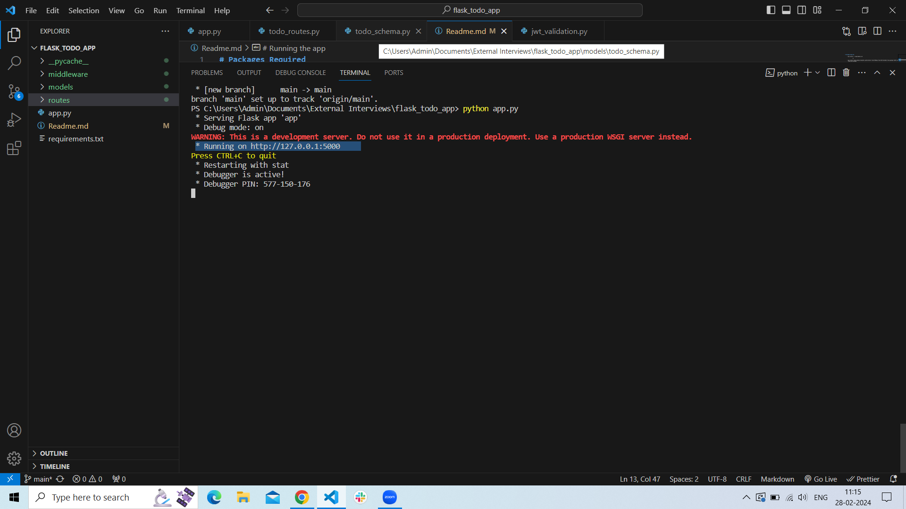

# Packages Required

    - pip install -r requirements.txt 

                or 
                
    - pip install Flask pymongo dnspython python-dotenv Flask-PyMongo Flask-JWT-Extended flask_pymongo PyJWT mongoengine              
      flask_jwt_extended

# Running the app
 
    - python app.py
    

